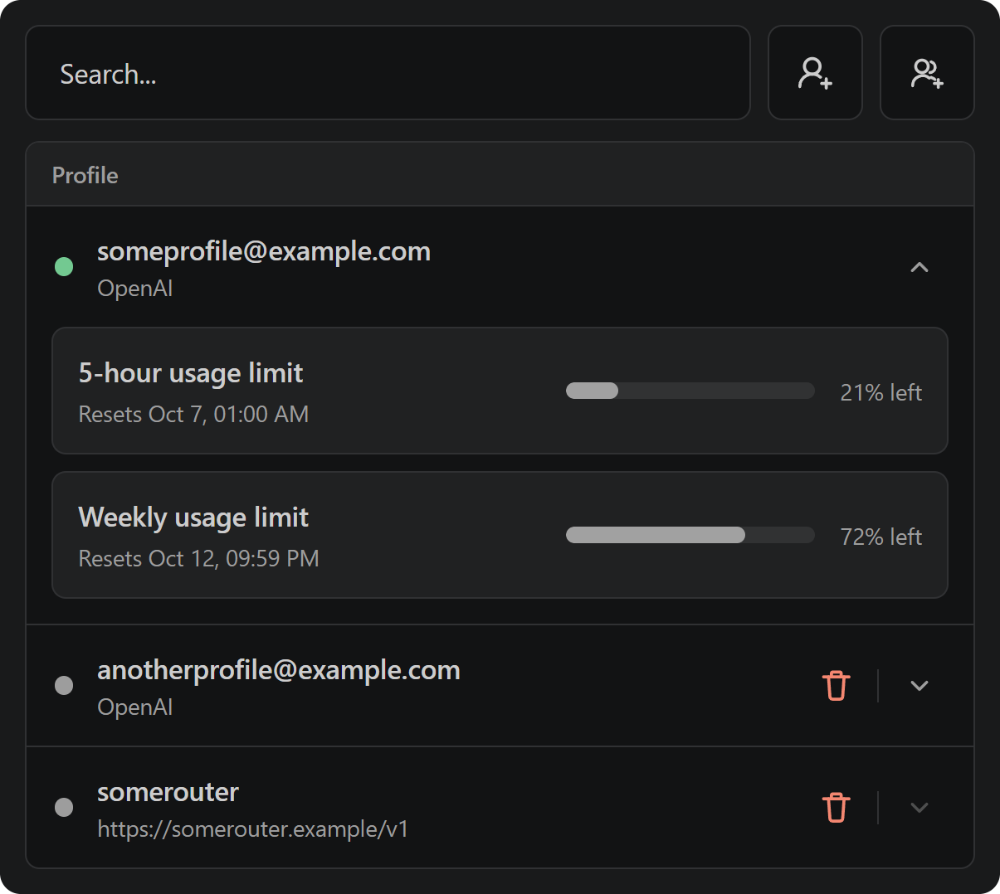

# Codex Profiles

Manage multiple Codex accounts and OpenAI-compatible providers from the VS Code secondary sidebar. Switching accounts keeps the same Codex home and conversation history.



## Features

- switch between saved Codex accounts;
- add accounts through the official Codex sign-in flow;
- view usage limits and reset times reported by Codex;
- configure OpenAI-compatible providers;
- keep account data local.

## Getting Started

1. Install the official OpenAI Codex extension and sign in.
2. Install **Codex Profiles** from the [Visual Studio Marketplace](https://marketplace.visualstudio.com/items?itemName=goosenest.codex-profiles), or run:

   ```shell
   code --install-extension goosenest.codex-profiles
   ```

3. Open **Codex Profiles** in the VS Code secondary sidebar.
4. Select **Add profile**, then complete the Codex sign-in.
5. Select any saved account to switch to it.

You can also use **Add provider** to configure an OpenAI-compatible endpoint instead of another OpenAI account.

## Switching Accounts

Select a saved account and confirm the switch. Codex Profiles restarts the Extension Host while the VS Code window and workspace remain open. Your Codex home and conversation history stay in place.

## Usage Limits

Expand an OpenAI account to see the usage windows and reset times returned by Codex.

Usage data refreshes at most once per minute for the active account and any expanded account. Closed inactive accounts are not checked, and provider profiles do not request OpenAI account limits.

## OpenAI-Compatible Providers

A provider profile contains a display name, base URL, and access token. Custom providers may keep their conversations separately from OpenAI account history.

## Local Data

Profiles, provider tokens, and cached usage data stay on your machine. Codex Profiles has no remote service or telemetry of its own.

VS Code windows using the same `CODEX_HOME` also use the same active Codex authentication. Switching in one of those windows therefore changes the account used by the others.

## Install From A VSIX

Download `codex-profiles-<version>.vsix` from the [latest GitHub release](https://github.com/GooseG4G/goosenest-codex-profiles/releases/latest), then run:

```shell
code --install-extension ./codex-profiles-<version>.vsix --force
```

VSIX installations do not receive automatic Marketplace updates.

## Requirements

- VS Code 1.106 or newer;
- the official OpenAI Codex extension installed in the same VS Code environment;
- an existing Codex sign-in for the first OpenAI account.

## Configuration

### `codexProfiles.codexHome`

Overrides the Codex home directory. When empty, Codex Profiles uses `~/.codex`.

## Development

Building requires Node.js `^20.19.0` or `>=22.12.0`, npm, and Git.

```shell
git clone https://github.com/GooseG4G/goosenest-codex-profiles.git
cd goosenest-codex-profiles
npm ci
npm test
npm run check
npm run build
npm run package
```

Open the repository in VS Code and press `F5` to launch an Extension Development Host. The platform scripts `build.ps1` and `build.sh` run the same checked build and place their output under `build/`.

## Disclaimer

Codex Profiles is an independent community extension. It is not affiliated with or endorsed by OpenAI or Microsoft.
